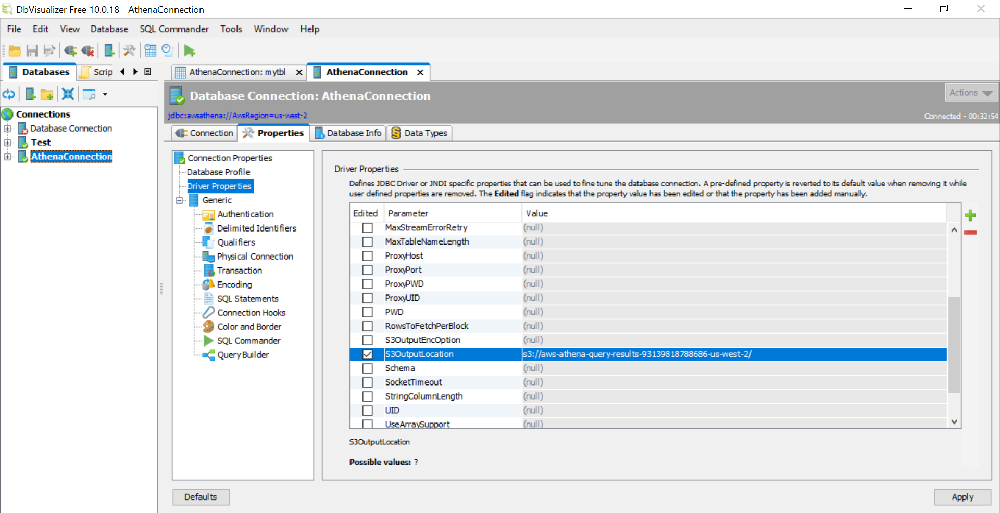

###################################
Athena-DBVisualizer Connection
###################################

STEP 1 : Download the athena JDBC driver(AthenaJDBC42-2.0.7.jar) from following link
--------

:Link: https://docs.aws.amazon.com/athena/latest/ug/connect-with-jdbc.html

STEP 2 : Download DBVisualizer from below link and install it.
--------

:Link: https://www.dbvis.com/download/

STEP 3 : Setup Driver Manager: 
--------

- Go to *‘Tools’* menu and click *‘Driver Manager’* and Add athena JDBC driver which is downloaded in step 1

STEP 4 : Create new database connection and add the parameter as follow.
--------

1) In connection Tab add the following parameters
==================================================

   
- Database UserId = Access_key
- Database Password = Secret_access_key

2) In Properties Tab do the following changes

   

Click on *‘Apply’*

STEP 5 :  Go to connection tab and click on *‘connect’*
--------

   
Now you can see the data in DBVisualizer.

